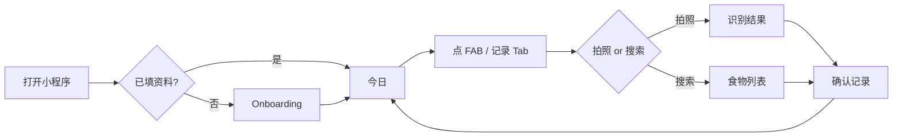

# 卡路里分析小程序 — 高保真原型方案

> 版本 v1.0 · 2026-05-17  
> 可交互预览：用浏览器打开 [prototype/index.html](./prototype/index.html)  
> 基准设备：iPhone 14/15 逻辑宽 **390px**，安全区按 iOS 规范预留  

---

## 1. 设计目标

| 维度 | 要求 |
|------|------|
| 核心体验 | **3 秒完成一笔记录**；首页 **3 秒内读懂**「还能吃多少」 |
| 气质 | 清爽、可信、偏「健康教练」而非冷冰冰医疗仪器 |
| 差异化 | **结论先行**（达标/注意/超标 + 剩余额度），再展示明细数字 |
| 模式感知 | 五种健康模式通过 **色条/文案/次要指标** 区分，不换整套 UI |

---

## 2. 设计系统（Design Tokens）

### 2.1 色彩

| Token | 色值 | 用途 |
|-------|------|------|
| `--brand` | `#1B7A5A` | 主色：导航栏、主按钮、正向进度 |
| `--brand-light` | `#E8F5EF` | 模式标签、达标背景 |
| `--brand-dark` | `#0F5C42` | 按下态、强调数字 |
| `--bg` | `#F4F6F8` | 页面底 |
| `--surface` | `#FFFFFF` | 卡片 |
| `--text` | `#1A1D21` | 主文案 |
| `--text-secondary` | `#6B7280` | 辅助说明 |
| `--warn` | `#D97706` | 注意 |
| `--danger` | `#DC2626` | 超标 |
| `--macro-p` | `#3B82F6` | 蛋白质条 |
| `--macro-c` | `#F59E0B` | 碳水条 |
| `--macro-f` | `#8B5CF6` | 脂肪条 |

**模式色条（顶部 4px 条，不改变主色）**

| 模式 | 色条 |
|------|------|
| 减脂 | `#1B7A5A` |
| 增肌 | `#2563EB` |
| 代谢管理 | `#7C3AED` |
| 孕产期 | `#DB2777` |
| 轻健康 | `#059669` |

### 2.2 字体（小程序可映射为 system + 加粗层级）

| 层级 | 字号 | 字重 | 场景 |
|------|------|------|------|
| Display | 40px | 700 | 首页剩余热量大数字 |
| H1 | 20px | 600 | 页面标题、食物名 |
| H2 | 17px | 600 | 卡片标题 |
| Body | 15px | 400 | 正文、列表 |
| Caption | 12px | 400 | 餐次标签、免责声明 |
| Num | 28–34px | 700 | Tabular 数字（热量） |

### 2.3 圆角与间距

- 卡片圆角 **16px**；按钮 **24px（全圆角胶囊）**；输入框 **12px**
- 页面左右边距 **16px**；卡片间距 **12px**；列表项垂直 **14px**

### 2.4 组件库（核心）

| 组件 | 说明 |
|------|------|
| `StatusPill` | 达标 / 注意 / 超标，绿/橙/红浅底 |
| `MacroBar` | 左标签 + 进度条 + 右 consumed/target |
| `CalorieRing` | 环形或粗进度条 + 中心剩余 kcal |
| `MealChip` | 早/午/晚/加餐，单选胶囊 |
| `FoodListCell` | 左名+分类，右 kcal/100g + 箭头 |
| `FAB` | 右下「+」，带阴影，跳转记录 |
| `ModeCard` |  onboarding 模式单选卡片 |
| `CandidateCard` | 拍照识别 Top3 候选 |

---

## 3. 信息架构

```
Tab：今日 | 记录 | 我的
  │
  ├─ [首次] 引导 Onboarding（全屏，无 Tab）
  ├─ 今日
  │    └─（计划）7 日趋势
  ├─ 记录
  │    ├─ 拍照 → 识别结果 → 确认记录
  │    └─ 搜索/常吃 → 确认记录
  ├─ 确认记录（子页，隐藏 Tab）
  └─ 我的
       ├─ 修改资料 → Onboarding（编辑态）
       └─ 隐私说明（区块）
```

---

## 4. 核心页面高保真说明

### 4.1 新用户引导 `onboarding`

**布局**

1. 顶部：插画区（碗+刻度线简约线稿，高 120px，品牌浅绿底）  
2. 标题：「欢迎使用食光」副标题一行说明  
3. 表单卡片：性别 Segmented、年龄/身高/体重 三列或纵向  
4. 活动量：单行 Picker  
5. **模式选择**：5 张纵向 `ModeCard`，选中描边品牌色 + 浅绿底  
6. 代谢/孕产选中时：底部橙色小字免责声明  
7. 底部固定：「开始使用」主按钮（安全区上）

**交互**

- 未填体重禁用主按钮  
- 提交成功 → `switchTab` 今日  

---

### 4.2 今日首页 `index`（核心）

**结构（自上而下）**

```
[模式色条 4px]
[顶栏] 5月17日 周六 · 减脂模式          [达标]
[主卡 CalorieRing]
  1286 / 1800 kcal
  ████████░░  71%
  「还可摄入 514 kcal」← Display 强调
[宏量卡]
  蛋白 ████░░  62/95g
  碳水 ██████  140/180g
  脂肪 ███░░░  42/55g
[今日记录]
  午餐  宫保鸡丁        390 kcal
  ...
[空态] 插图 + 「拍一张餐图，3秒记一笔」
[FAB +]
[TabBar]
```

**状态变体（需出 3 套截图）**

| 状态 | 进度色 | 文案 |
|------|--------|------|
| 达标 | 绿 | 还可摄入 N kcal |
| 注意 | 橙 | 接近上限，还剩 N kcal |
| 超标 | 红 | 已超出约 N kcal |

**代谢模式附加行**：钠、糖 细进度（第二组 MacroBar）

---

### 4.3 记录页 `record`

**结构**

1. **主操作区**（大卡片渐变绿）  
   - 左：相机图标  
   - 文案：「拍照记录」副标题「识别菜品，确认后保存」  
2. **搜索区**  
   - 圆角搜索框 + 放大镜  
   - 结果列表 `FoodListCell`  
3. **最近常吃**（横向 Chip 滚动）  
4. 底部 Tab  

**拍照分支 → 识别结果页（子页）**

- 顶：用户上传图圆角预览  
- 「为您识别到」  
- Top3 `CandidateCard`：菜名、置信度条、≈ kcal  
- 底部：「都不对，手动搜索」文字链  

选中候选 → 进入 **确认记录**

---

### 4.4 确认记录 `confirm`（关键转化页）

**原则**：所有录入方式统一到此页，减少开发分支。

```
[导航] 确认记录
[食物头]
  宫保鸡丁
  家常菜 · 每100g 195 kcal
[餐次]  ○早餐 ●午餐 ○晚餐 ○加餐
[份量]
  [ − ]   200 g   [ + ]     （步进 10g）
  提示：默认 1份 ≈ 200g
[预估卡]
  ┌────┬────┬────┬────┐
  │390 │23g │31g │28g │
  │kcal│蛋白│碳水│脂肪│
  └────┴────┴────┴────┘
[固定底] 确认记录
```

**交互**：改份量实时刷新预估；确认 → Toast → 回今日 Tab  

---

### 4.5 我的 `profile`

1. **用户条**：头像占位、昵称、当前模式标签  
2. **身体数据卡**：列表只读 + 「修改资料」  
3. **今日目标卡**：四行目标数字（灰底数字块）  
4. **切换模式**：底部 Sheet 或 Picker（5 项说明）  
5. **隐私**：两段静态说明  

---

### 4.6 7 日趋势 `trend`（M3，原型先行）

- 顶：周选择器 ‹ 本周 ›  
- 柱线组合图：热量柱 + 蛋白折线  
- 下方：日均 vs 目标 小结一句  
- 轻健康模式：强调「比上周少 8%」绿色文案  

---

## 5. 关键用户流程（需原型可点通）



---

## 6. 交付物清单

| 交付物 | 路径 | 说明 |
|--------|------|------|
| 交互原型 HTML | `design/prototype/index.html` | 浏览器打开，底部切换 8 个屏幕 |
| 本方案文档 | `design/PROTOTYPE.md` | 标注、Token、状态说明 |
| 推荐设计工具延续 | Figma | 可按本文 Token 建 Component Set |

### Figma 画板建议（导出标注用）

| 画板名 | 尺寸 | 数量 |
|--------|------|------|
| 01_Onboarding | 390×844 | 1 |
| 02_Home_OK / WARN / OVER | 390×844 | 3 |
| 03_Record | 390×844 | 1 |
| 04_Recognize | 390×844 | 1 |
| 05_Confirm | 390×844 | 1 |
| 06_Profile | 390×844 | 1 |
| 07_Trend | 390×844 | 1 |
| 08_Metabolic_Home | 390×844 | 1（模式差异） |

---

## 7. 与现有实现对齐

| 原型页 | 代码路径 | 状态 |
|--------|----------|------|
| 今日 | `pages/index` | 已实现基础版，可按本方案视觉升级 |
| 记录 | `pages/record` | 已实现，缺独立识别结果页 |
| 确认 | `pages/confirm` | 已实现 |
| 引导 | `pages/onboarding` | 已实现 |
| 我的 | `pages/profile` | 已实现 |
| 趋势 | — | 待开发 |
| 识别结果 | — | 待开发（当前拍照直达确认） |

---

## 8. 评审检查项

- [ ] 首页是否 **第一眼看到剩余 kcal**？  
- [ ] 确认页是否 **任何入口统一**？  
- [ ] 超标态是否 **不羞辱用户**（文案中性）？  
- [ ] 孕产/代谢是否有 **免责声明**？  
- [ ] 主按钮拇指区是否 **单手可达**（底固定）？  
